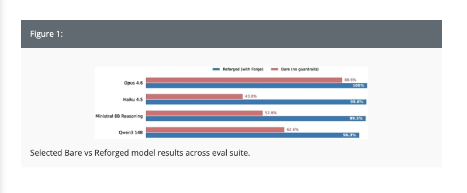

<!-- _class: lead -->

# Self-Hosting Agents

## Small Dense Models Change the Economics

Miriah Peterson · @Soypete<br>
AI Builder Day · August 14, 2026

---

## Who Am I?

- CEO & founder of a stealth startup
- Co-host of the **Domesticating AI** podcast
- Creator of Pedro Agentware
- Building AI systems since 2022

---

<!-- _class: lead -->

# What Is an Agent?

```text
observe → decide → call a tool → inspect the result
   ↑                                      ↓
   └──────────────── repeat ──────────────┘
```

## A model running inside a loop

<!-- A chat response is usually one inference. An agent keeps returning to the
model between actions. The harness—not the model alone—owns tools, state, retries,
and the stopping condition. -->

---

## What Do Agents Enable?

| Stage | Agent behavior |
|---|---|
| **One-off** | complete a task while I wait |
| **Background** | run a workflow without me watching |
| **Autonomous** | notice, decide, act, and recover |
| **Always on** | keep doing the job whenever work appears |

**The value grows as the agent needs less of my attention.**

<!-- Start with the familiar one-off coding or research agent. Background agents
run on a schedule or queue. Autonomous agents decide which actions to take and how
to recover. The end state is not one magical run; it is a dependable worker that is
available whenever new work arrives. -->

---

<!-- _class: lead -->

# Always Means Always


<!-- Let the GIF breathe. The point is not that every agent must run in a hot loop.
It is that useful automation creates demand for an agent that is ready continuously,
whether triggered by a message, schedule, queue, webhook, or new data. -->

---

<!-- _class: lead -->

# The Problem

## “Always on” is expensive for Everyone

| You pay | The provider pays |
|---|---|
| tokens on every turn | compute for every token |
| repeated agent loops | accelerators and memory |
| availability | idle capacity and scheduling |

<!-- This is the pivot. For the customer, metered tokens turn agent activity into
recurring spend. For the provider, each token consumes accelerator time, memory
bandwidth, capacity, cooling, and power. Providers therefore have the same incentive
we do: reduce the compute required per token. That incentive helped push MoE models
into the mainstream.  Also remember that we are using so mcuh copute for inference that we are having to build
data centers to get more training-->

---

## MoE: More Capacity, Less Compute per Token

Instead of using every parameter for every token, a router selects a few experts:

```text
397B total parameters
       ↓ route each token
 17B active parameters
```

**Local hosts can keep inactive experts in system RAM and move selected experts through the GPU.**

<!-- MoE expands total capacity without making every token pay for every expert.
This lowers active compute, which matters at provider scale. It also made surprisingly
powerful models accessible to local hosts: the complete quantized model can live in
larger, cheaper CPU memory while only routed experts are staged through limited GPU
VRAM. The tradeoff is CPU-to-GPU transfer latency and bandwidth. Shared attention and
other non-expert layers still run; MoE routes expert feed-forward blocks, not arbitrary
transformer layers. Sources: https://arxiv.org/abs/2101.03961 and
https://arxiv.org/abs/2603.19289 -->

---

## “Local Model” Covers Two Different Bets

| Large local model | Small local model |
|---|---|
| capacity through MoE | efficiency through dense weights |
| weights spill into system RAM | weights fit on one GPU |
| fewer parameters active per token | every parameter active per token |
| maximize capability | minimize cost per completed job |

**Choose for the workload—not for the leaderboard.**

<!-- This distinction was missing in the first version of the talk. “Running
locally” can mean making an enormous MoE model possible with CPU RAM and partial GPU
offload, or making a small dense model extremely fast by keeping it entirely in VRAM.
The large-model bet buys more capacity but accepts memory traffic and operational
complexity. The small-model bet only works when the task and harness are constrained
enough, but it gives the agent fast, cheap turns. -->

---

<!-- _class: lead -->

# “We Are Kids in a Candy Store”

> “We are kids in a candy store.”
>
> — Chris Brousseau

## [▶ Watch the short on YouTube](https://youtube.com/shorts/ljxaBcd5zx8)

<!-- Open the link in a browser during the talk, then return to the deck. This is
the emotional pivot: the old consumer constraint has changed. -->

---

<!-- _class: lead -->

# Can we make Cheaper Agents more effective?

## Small, dense, and actually local

**We genuinely do not know the ceiling yet.**

<!-- Qwen3.6-27B is a 27B dense model, post-trained for agentic coding and
structured tool use, and small enough to run on one high-end consumer GPU when
quantized. With a dense model, every model parameter participates in every token.
What we know: these models are trained for tools, fast enough for iterative loops,
and available for us to operate. Source: https://huggingface.co/Qwen/Qwen3.6-27B -->

---

## What Does “Reasoning” Mean Here?

The harness asks the model to repeatedly choose the next step:

```text
interpret the request
        ↓
choose an action or tool
        ↓
observe the result
        ↓
decide: continue, recover, or stop
```

**Ambiguity creates decisions before the real work even begins.**

<!-- OpenCode makes this loop easy to see. Give it a request and watch it interpret
the task, inspect files or search for context, choose a tool, read the result, and
decide whether it has enough information to act or stop. “Thinking” is not magic and
this talk does not depend on exposing private chain of thought. Operationally,
reasoning is the model inferring enough about intent and state to choose the next
action. ReAct describes the same pattern as interleaved reasoning, actions, and
observations. Ambiguity adds decisions before the real work begins; every choice is
another opportunity for a wrong tool, extra turn, or over-the-wire call. Source: Yao
et al., “ReAct: Synergizing Reasoning and Acting in Language Models,”
https://arxiv.org/abs/2210.03629 -->

---

<!-- _class: lead -->

# The Subproblem

## Small models have less margin for ambiguity and recovery

One bad turn can become three expensive turns—or a complete restart.

---

## The Harness Is the Agent System

```text
request
  ↓
workflow + scoped tools + state
  ↓
model chooses one next action
  ↓
validate → execute → observe → retry or stop
  ↓
telemetry + durable result
```

**The model supplies judgment. The harness supplies reliability.**

<!-- Slow down here. A harness is not merely the library that sends a prompt. It
owns the loop around the model: task decomposition, which tools are visible, durable
state, context assembly, validation, execution, retry policy, stopping conditions,
and observability. This is why a smaller model can succeed: more of the job is made
deterministic outside inference. Pedro CLI is my hand-rolled example; Forge and Pedro
Agentware package the reliability mechanisms for other harnesses. -->

---

## Forge: Reliability Outside the Model

Antoine Zambelli's Forge adds:

1. **response validation**
2. **rescue parsing**
3. **corrective retry nudges**
4. **optional workflow enforcement**
5. **context compaction**

**The model proposes the next action; the harness makes the loop survivable.**

<!-- Forge is a reliability layer for self-hosted tool calling, not another agent
or planner. It preserves model-native tool calls, catches unknown or malformed calls,
rescues structured calls emitted in fences/XML/vendor formats, and feeds actionable
errors back to the model. Sources:
Repo: https://github.com/antoinezambelli/forge
CAIS 2026 demo/paper: https://www.caisconf.org/program/2026/demos/forge-agentic-reliability/
Author discussion and results context: https://news.ycombinator.com/item?id=48192383 -->

---

## Guardrails Change Completion Rates



Selected bare vs. Reforged results across the evaluation suite.

[CAIS 2026 demo and paper](https://www.caisconf.org/program/2026/demos/forge-agentic-reliability/) · [Author discussion on Hacker News](https://news.ycombinator.com/item?id=48192383)

<!-- Read the chart as workflow completion, not general intelligence. The same model
becomes dramatically more reliable when the harness validates calls, rescues malformed
formats, returns useful errors, and retries. Zambelli notes that 90% per-step accuracy
across five required steps yields roughly a 41% chance of at least one failure:
1 - 0.9^5 ≈ 0.41. This is why small per-turn weaknesses compound in agents. The
figure was supplied from the Forge CAIS material. -->

---

## Why Forge Does “Crazy” Stuff

```text
wrong format
    ↓
rescue the call ──or── explain the error and retry
    ↓
continue the same job with compacted context
```

- rescue avoids paying for another inference
- precise nudges prevent blind retries
- step enforcement stops repeated or premature actions
- compaction stops every turn from carrying the whole past

**Reliability guardrails are token controls.**

<!-- Connect each mechanism to the bill. Rescue parsing converts already-paid-for
output into a usable call. A corrective retry is more expensive than rescue but much
cheaper than restarting without guidance. Step enforcement prevents loops. Compaction
reduces the repeated input cost on every remaining turn. Forge reports taking an 8B
local model from single digits to 84% across its 26-scenario v0.7.0 evaluation suite;
use the paper for the methodology and ablations: Zambelli, “Forge: Closing the Agentic
Reliability Gap Between Self-Hosted and Frontier Language Models,”
https://doi.org/10.1145/3786335.3813193. Additional sources:
https://www.caisconf.org/program/2026/demos/forge-agentic-reliability/
https://news.ycombinator.com/item?id=48192383 -->

---

<!-- _class: lead -->

# Demo: One GPU, Real Agents

## Qwen3.6-27B · RTX 5090 · my house

We need to prove **speed, tool use, and completed work**.

---

## Demo 1: A Multistep Agent Over the Wire

```text
conference laptop → Tailscale → home inference server → RTX 5090
```

## **BUILD: multistep agent web UI**

The UI must expose the loop:

- task and current step
- tool call and arguments
- tool result
- retries, token counts, and final verification

<!-- Replace the chat-shaped PedroGPT demo. A single streamed response proves model
speed but not an agent. Use one bounded job requiring at least three visible tool
calls and a machine-checkable final result. The request still travels from the venue
over Tailscale to the home RTX 5090. Keep a recorded run as the primary conference
fallback. -->

---

## Demo 2: Measure the Local Server

```bash
cd ~/code/pedro/pedro-ops/scripts/pedrogpt/benchmark

go run . -url http://pedrogpt:8000/v1 \
  -model qwen3.6-27b-mtp -n 10

go run . \
  -prompt "Write a Go HTTP server with graceful shutdown." \
  -max-tokens 512
```

**TTFT · prompt tok/s · generation tok/s · p50/p95 latency · MTP acceptance**

<!-- Run the first command for ten comparable requests against llama-server. It
discards a warmup by default, streams /v1/chat/completions, reads llama.cpp's own
prompt and generation timings, and reports client-side TTFT and total latency. The
second command demonstrates a longer, recognizable coding response. Explain that the
browser demo includes network latency; this benchmark isolates the serving path more
directly. Real source: ~/code/pedro/pedro-ops/scripts/pedrogpt/benchmark -->

---

## Tool Calls: Pedro Tag in Discord

```python
async def start_game_tool(
    context: RunContext[AgentDeps], game_type: str
) -> str:
    if game_type == "20_questions":
        game_id = context.deps.thread_id \
            or context.deps.channel_id
        # Create and persist game state...
```

**LIVE: `@Pedro, play 20 Questions.`**

<!-- Real source: ~/code/pedro/pedro-tag/src/pedro_service/agent.py and
src/pedro_service/games/twenty_questions.py. Call out the turns: tool schema in,
tool call out, game state and user answer back in, repeated until success. This is
exactly the token multiplication described at the beginning. -->

---

## Production Serving

| **vLLM** | **llama.cpp** |
|---|---|
| NVIDIA throughput | hardware portability |
| continuous batching | GGUF quantizations |
| scheduling + metrics | lightweight server |
| OpenAI-compatible tools | OpenAI-compatible tools |

<!-- I would start production evaluation with vLLM or llama.cpp. Use vLLM for a
dedicated NVIDIA server where concurrency matters. Use llama.cpp when hardware or
GGUF portability drives the decision. I would not use Ollama or LM Studio as my
production serving layer. Sources: https://docs.vllm.ai and
https://github.com/ggml-org/llama.cpp -->

---

<!-- _class: lead -->

# Back to the Problem

## Agents are expensive.

One response becomes many turns.<br>
One task becomes an always-on workload.

## Useful agents maximize inference.

<!-- The demos prove that small local models can be fast and can do real work.
Now return explicitly to the opening problem. The value of an agent comes from the
loop, but every trip through that loop invokes inference again. When the agent becomes
useful, we deliberately give it more work and keep it available. That is why the cost
problem grows with success. -->

---

## Every Turn Has a Token Bill

```text
instructions + tools + history + result → next decision
```

Every turn carries forward:

- instructions and tool schemas
- relevant conversation and workflow state
- tool results from the previous turn

**A ten-turn job repeatedly pays to reconstruct the model's working state.**

<!-- Now introduce cost, after the audience has seen what always-on automation can
do and watched the local model perform. Tool schemas are input tokens. Tool arguments
are output tokens. Tool results return as more input tokens. In a naive agent, the
same instructions, schemas, and history are sent again on every turn. The useful unit
is cost per completed job, not cost per prompt. -->

---

## Reliability Multiplies the Bill

```text
bad call → error → retry → corrected call → verification
```

One mistake can add several turns—or restart the job.

- rescue parsing reuses output already generated
- corrective nudges avoid blind retries
- compaction reduces every remaining turn

**Reliability guardrails are also token controls.**

<!-- A malformed call consumes output tokens; the error becomes input; the retry
replays context; verification adds another turn. A late failure carries the most
accumulated context. If the harness gives up and restarts, it may repay the entire
job. Tie this back to why Forge does seemingly crazy recovery work. -->

---

## When the Economics Work

### Pros

- recurring per-token rent becomes fixed infrastructure
- well-defined jobs fit smaller, efficient models
- high utilization amortizes the GPU
- good context engineering reduces inference and tokens

### Costs

- idle GPU time is still your bill
- model loading creates cold starts
- scheduling, queues, memory, and failures become your problem

**Known job + reliable harness + high utilization = a compelling local case.**

---

## Compute Cost Is Not Token Cost

```text
compute cost per job = GPU $/second × occupied seconds ÷ completed jobs
```

| Example capacity | Current rate |
|---|---:|
| RunPod RTX 5090 Pod | $0.99 / GPU-hour |
| RunPod RTX 5090 Serverless | $1.58 / active GPU-hour |
| Modal L40S | $0.000542 / second ≈ $1.95 / GPU-hour |

**Scale-to-zero wins when idle. A dedicated GPU wins only when you keep it busy.**

<!-- Rates checked August 14, 2026; refresh them before every talk. These are not an
apples-to-apples hardware benchmark. They illustrate purchasing models: RunPod Pods
reserve a GPU; RunPod Serverless and Modal meter active compute and can avoid idle
time, with cold-start and warm-container tradeoffs. At 730 hours, an always-on $0.99
GPU is about $723/month before storage and networking. Do not compare this directly
to API token prices until the benchmark provides throughput and completed-job rate.
Sources: https://www.runpod.io/pricing and https://modal.com/pricing -->

---

<!-- _class: lead -->

# The Takeaway

## Find the smallest model that reliably completes the job.

1. Measure tokens, turns, runtime, and completion rate.
2. Reduce ambiguity with context engineering.
3. Put validation, rescue, retries, and compaction around the loop.
4. Keep the inference infrastructure utilized.

**Optimize the system—not just the model.**

---

<!-- _class: lead -->

# Miriah Peterson · @Soypete

## CEO & founder, stealth startup

## Co-host, **Domesticating AI** podcast

---

<!-- _class: lead -->

# Appendix

## Optional discussion after the outro

---

## Pedro CLI: I Rolled My Own Harness

```go
type Phase struct {
    Name         string
    SystemPrompt string
    Tools        []string
    MaxRounds    int
    Validator    func(*PhaseResult) error
}
```

**Each phase scopes the prompt, tools, budget, and definition of done.**

<!-- This is the useful Pedro CLI story for the abstract: I did not merely point a
coding model at a shell. I built the orchestration layer. The phased executor owns
analyze/plan/implement/validate-style workflows, per-phase tool availability, round
limits, validation, callbacks, subagents, artifacts, and telemetry. Source:
~/code/pedro/PedroCLI/pkg/agents/phased_executor.go -->

---

## Context Is an Operational Resource

```text
save prompts + responses + tool calls + full tool results
                          ↓ 75% of context window
summarize old rounds + keep recent rounds + measure the reduction
```

- truncate what goes over the wire
- preserve full tool output for retrieval
- record tokens before and after compaction

**Context management is part of the runtime—not prompt decoration.**

<!-- Pedro CLI's context manager persists every step, caches full tool results while
allowing aggressive prompt truncation, and triggers compaction at 75% of the model's
context window. It measures tokens before/after, rounds compacted/kept, and compaction
latency. This backs up the abstract's context-management claim with a real harness.
Source: ~/code/pedro/PedroCLI/pkg/llmcontext/manager.go -->

---

## Observe and Evaluate the Whole Job

```text
job → phases → rounds → inference + tool calls
```

Measure:

- prompt, completion, and total tokens
- model latency and tokens per second
- tool calls, failures, rounds, and exit reason
- completion score across repeated trials

**The unit of reliability is the completed workflow.**

<!-- The telemetry summary reports tokens, tool calls, rounds, phases, duration, and
estimated cost per job. The eval harness saves full transcripts, supports repeated
trials and concurrency, and records latency, throughput, and grading results. This is
how to expose evaluation variance instead of trusting one demo run. Sources:
~/code/pedro/PedroCLI/pkg/telemetry/types.go and pkg/evals/types.go -->

---

## Where This Goes Next: LoRAs

Long-running agents create labeled trajectories:

```text
task + context + tool calls → successful result
```

- specialize the model for the repeated job
- improve accuracy
- reduce context shipped per request
- toggle adapters without another always-on model

<!-- Unsloth Studio is an approachable on-ramp from captured trajectories to a
first LoRA. It is not the production inference server. -->

---

## Keep the Control Plane on CPU

```text
request → CPU queue → wake GPU → batch → drain → stop GPU
```

Use inexpensive, always-on CPU for:

- API, authentication, and routing
- queues, context assembly, and scheduling
- health checks and GPU lifecycle

<!-- Keep the agent available without paying GPU rates while it waits. The tradeoff
is that model loading becomes a cold-start budget. Further reading:
https://northflank.com/blog/runpod-vs-modal -->

---

## GPU Scheduling Is Hard

- model weights and KV cache compete for VRAM
- batching improves throughput but adds request latency
- queues require priorities, limits, and backpressure
- failures can strand work or GPU capacity

**A fast model does not make a reliable serving system.**

---

## If Asked: What About Model Quality?

Model-quality comparisons are not the focus of this talk.

The relevant question is whether the smallest reliable model can complete **your defined job** at the utilization and cost you need.

---

## From One-Off to Always On

```text
prompted once → scheduled → event-driven → continuously available
```

An always-on agent needs:

- durable state between runs
- tools it can call without supervision
- recovery when a step fails
- inference whenever new work arrives

**The agent stops being a feature and becomes infrastructure.**

<!-- Do not discuss cost yet. Establish the operational change: one-off agents can
borrow an endpoint for a moment; always-on agents depend on inference as a persistent
part of the system. Availability, state, recovery, and scheduling now matter. -->

---

## Pedro Agentware

### Forge's reliability pattern, ported beyond Python

```text
native tool calling
      +
validation, rescue, retries
      +
context compaction
      ↓
Go · Python · TypeScript
```

**The same harness idea around whichever agent framework you already use.**

<!-- Pedro Agentware is a port of Forge's pattern to other languages. Do not discuss
policy enforcement; that belongs to the unmerged Kei plugin and is not part of this
talk. -->

---
