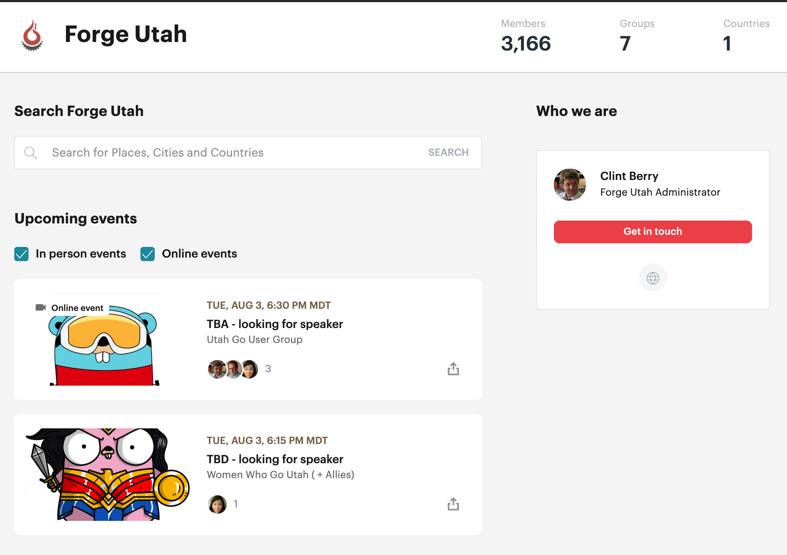
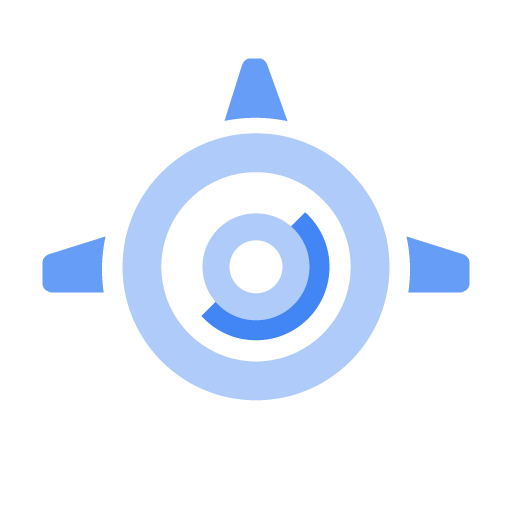
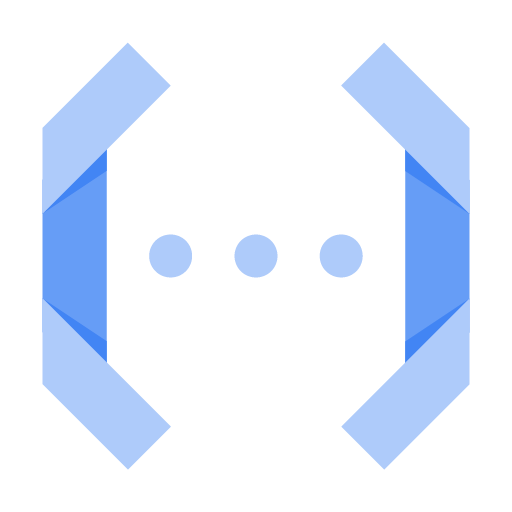

# Using GCP and Docker for Schedule Based GO Scripts
Miriah Peterson
___

## Bio
- golang + rust streamer Twitch : [@soypete](https://www.twitch.tv/soypete01)
- Organizer [GoWest Conference](https://gowestconf.com) 
- Proud Dog Mom
- [Twitter @captainnobody1](https://www.twitter.com/captainnobody1)
- [GitHub soypete](https://www.github.com/soypete)


---

## Set the Stage
<!-- - I want to get a weekly list of upcoming Forge Foundation events
- Meetup api has oauth requirements
- They would not grant me a token
- I build a Web Scrapper to get the event information -->


---

<!--- Time to hack out a solution--->


---

## Web Scrapper

* build using go! <!--- This is not the typical choice but their are tools for navigating the dom--->
  * [utah air quailty example](https://github.com/Soypete/Example-Web-Crawler/blob/master/main.go)
  * [dom parser](github.com/PuerkitoBio/goquery)

  [crawler code](https://github.com/soypete/event-web-crawler)
  
---

## Web Scrapper

* firestore for storage <!--- there were two motivations for --->
  * [firestore](https://firebase.google.com/docs/firestore/quickstart)
  * [firestore go client](cloud.google.com/go/firestore)
  * [firestore go talk from utah go meetup](https://www.youtube.com/watch?v=_XQZQZ_QZqw)

[crawler code](https://github.com/soypete/event-web-crawler)

---

## Web Scrapper

* want a weekly pull for historical meetup data
  * meetup name
  * talk title and description
  * _number of attendees_ (to be implemented)
  
  [crawler code](https://github.com/soypete/event-web-crawler)

  ---

## Web Scrapper

```json
{
  "@context": "http://schema.org",
  "@type": "Event",
  "name ": "Building CLI apps in Golang ",
  "url": "https://www.meetup.com/Women-Who-Go-Utah/events/277283469/",
  "description": "",
  "startDate": "2021-05-25T18:30-06:00",
  "endDate": "2021-05-25T20:30-06:00",
  ...
  "location": { ... },
  "organizer": {
    "@type": "Organization",
    "name": "Women Who Go  Utah ( + Allies)",
    "url": "https://www.meetup.com/Women-Who-Go-Utah"
  }
}
```

--- 
## Web Scrapper

1. call web address to get the site file
1. parse the site file to get the event information
1. Take the json and Dump it to a cloud firestore

[crawler code](https://github.com/soypete/event-web-crawler)

---
## Web Scrapper

CODE TIME!


<!-- - demo the web scrapper and show it work -->


---
## Cron Job

Running cron jobs on Google Cloud Platform.

---
## Cron Job
Running cron jobs on Google Cloud Platform.

Options:
- [App Engine Cron](https://cloud.google.com/appengine/docs/flexible/nodejs/scheduling-jobs-with-cron-yaml)


---
## Cron Job
Running cron jobs on Google Cloud Platform.

Options:
- [App Engine Cron](https://cloud.google.com/appengine/docs/flexible/nodejs/scheduling-jobs-with-cron-yaml)
- [Cloud Functions + Scheduler](https://cloud.google.com/scheduler/docs/tut-pub-sub)



---
## Cron Job
Running cron jobs on Google Cloud Platform.

Options:
- [App Engine Cron](https://cloud.google.com/appengine/docs/flexible/nodejs/scheduling-jobs-with-cron-yaml)
- [Cloud Functions + Scheduler](https://cloud.google.com/scheduler/docs/tut-pub-sub)
- [Cloud Run + Scheduler](https://cloud.google.com/run/docs/triggering/using-scheduler)

---
## Cron Job
Running cron jobs on Google Cloud Platform.

Options:
- [App Engine Cron](https://cloud.google.com/appengine/docs/flexible/nodejs/scheduling-jobs-with-cron-yaml)
- [Cloud Functions + Scheduler](https://cloud.google.com/scheduler/docs/tut-pub-sub)
- [Cloud Run + Scheduler](https://cloud.google.com/run/docs/triggering/using-scheduler)
- [Kubernetes Cron on GKE](https://cloud.google.com/kubernetes-engine/docs/how-to/cronjobs)

---
## Cron Job

### Step 1: Create a docker image
```dockerfile
FROM golang:alpine

WORKDIR /app
COPY go.* ./
RUN go mod download

COPY . ./
COPY --chown=root permissions/meetup-crawler-store-b25be2c787ec.json ./creds.json
RUN go build -v -o scraper

CMD ["/app/scraper"]
```
---
## Cron Job

### Step 2: Add the docker image to the Google Cloud Registry
```bash
bash 
gcloud builds submit --tag gcr.io/meetup-crawler-store/web-crawler
```

---
## Cron Job

### Step 3: Add image to Cloud Run Instance
```bash 
gcloud run deploy --image gcr.io/meetup-crawler-store/web-crawler --platform managed
```
---
## Cron Job

### Step 4: Create Endpoint for Calling Cloud Run
```go
	log.Print("starting server...")
	http.HandleFunc("/crawl", runCrawler)
	http.HandleFunc("/health", healthCheck)

	// Determine port for HTTP service.
	port := os.Getenv("PORT")
	if port == "" {
		port = "8080"
		log.Printf("defaulting to port %s", port)
	}
```

--- 
## Cron Job

### Step 5: Create schedule for calling the Cloud Run

```bash
gcloud scheduler jobs create http test-handler --schedule "5 * * * *"  
--http-method=Get 
--uri=https://{app_address}/crawl
--oidc-service-account-email=web-crawler-scheduler@meetup-crawler-store.iam.gserviceaccount.com
--oidc-token-audience=https://{app_address}/crawl
```
---

## Why not Cloud functions?

1. cloud functions support go
1. cloud functions can run on a schedule
1. cloud functions can be still connect to firestore

* [Cloud Functions](https://cloud.google.com/functions)
* [Cloud Functions + Scheduler](https://cloud.google.com/scheduler/docs/tut-pub-sub)

---
## Why not Cloud functions?


---
## Hurdles
- Creating service accounts 
- Adding the firebase permissions
- Accessing logs
- Exposing endpoints


---
## Summary
* Go is the best programming language! 
* Docker support makes it really easy to create a containerized applications/scripts. 


---
## Questions
Thanks you for coming out to this talk!
[twitch.tv/soypete01](https://twitch.tv/soypete01)
[twitter.com/captainnobody1](https://twitter.com/captainnobody1)
[youtube.com/captainnobody1](https://www.youtube.com/channel/UCeXy81WS-kX9JBc2kNzrV3A)

---
## Resources
- [Firestore video](https://www.youtube.com/watch?v=lIyPvpWqxKM)
- [Crawler streams](https://youtu.be/LsJQqa-kW6Q)
- [crawler code](https://github.com/soypete/event-web-crawler)