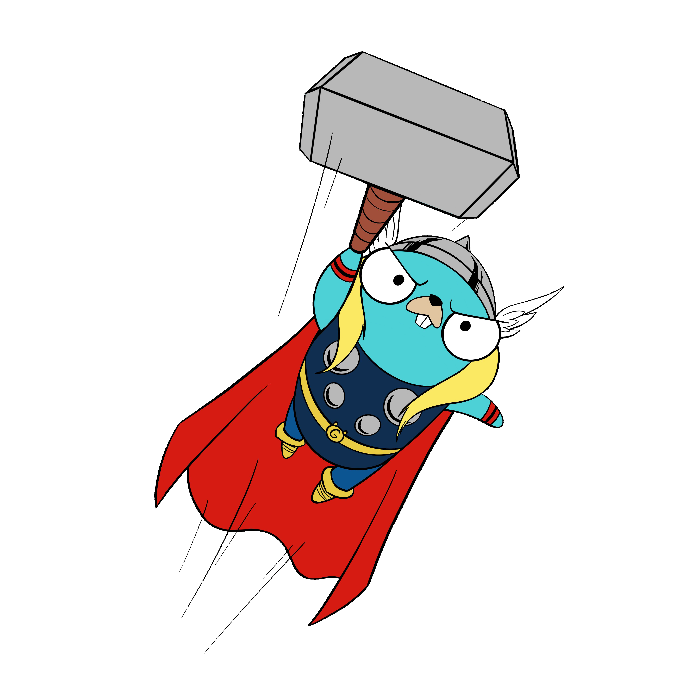

# Cross Compiling Go Apps
Miriah Peterson

---

## Bio
- [Member of Techical Staff @ Tailscale](https://tailscale.com/careers/)
- Software development streamer [@soypete01](https://www.twitch.tv/soypete01)
- Proud Dog Mom
- [Twitter @captainnobody1](https://www.twitter.com/captainnobody1)
- [GitHub soypete](https://www.github.com/soypete)


---
# GoWestConf



---

# What is Cross Compilation?

Compiling a go binary for a different OS than you are currently running on

---

# 3 Methods

1. Go compiler
1. Docker builds
1. Zig compiler

---

# Go Compiler

```bash
$ GOOS=windows GOARCH=amd64 go build main.go
```

---
# Go Compiler

```bash
$ GOOS=js GOARCH=wasm go build main.go
```
---

# Docker Builds

```bash
FROM golang:1.18-alpine

RUN apk update
RUN apk add git

WORKDIR /app
COPY go.* ./
RUN go mod download

COPY . ./
RUN go build -v -o main.go

CMD ["/app/main"]
```

---

# Zig Compiler
For when your hardware doesn't quite align

```bash
$ CGO_ENABLED=1 GOOS=linux GOARCH=amd64 
CC="zig cc -target x86_64-linux" 
CXX="zig c++ -target x86_64-linux" 
go build --tags extended
```

[Compilation Just Works](https://dev.to/kristoff/zig-makes-go-cross-compilation-just-work-29ho)

---

# Take away

Dev environment does not limit where you deploy your apps. 

---
# Thanks 

[Get your tickets to GoWest](https://gowestconf.com)