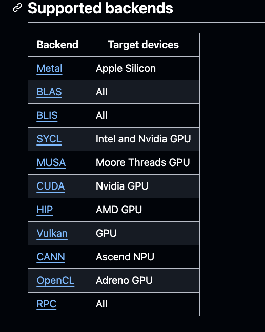

<!-- _class: lead -->

# Building Production AI with Go  
### A Live PostMortem
by: Miriah Peterson  

---

## Who Am I?

- Engineer & tinkerer (6+ years writing Go professionally)
- Tech lead on data + AI systems
- Organizer of GoWest, Forge Utah, Women Who Go Utah
- Built [Pedro](https://github.com/soypetetech/IAM_pedro) — a Twitch & Discord AI bot
- Stream all my work at [twitch.tv/soypetetech](https://twitch.tv/soypetetech)


---

## The Big Question

**How do we actually build production-ready AI in Go?**

- APIs vs self-hosted models  
- Latency, scaling, and reliability  
- Go-specific techniques that matter in real deployments  
- What’s possible today, and what isn’t  

---

## Quick Poll 👋

<!-- add a poll that is connected to pedro so that the people can interact with pedro. this will connect to prometheus and we will get metrics. we can use "agents" to correlated the data and sumarize the poll. -->

- Who here has called the OpenAI API from Go?  
- Who here has tried self-hosting with Llama.cpp / Ollama?  
- Who has put AI into production at work?  

---

## Model Selection & Trade-offs

- **APIs (OpenAI, Anthropic, Meta):**  
  - Lower latency (on their infra)  
  - Scales easily  
  - Clearer reliability guarantees  
- **Self-hosting (Ollama, Llama.cpp, vLLM):**  
  - More control, ownership of data  
  - Lower cost at scale (if infra is in place)  
  - Higher latency + scaling challenges  

---

### CPU vs GPU

- **CPU inference** = cheap but slow  
- **GPU inference** = fast, but expensive + requires infra  
- For production: GPUs are required to scale  
- For local dev/homelab: CPUs are “good enough” to iterate  



---

<!-- _class: demo -->

## Demo: Self-Hosting with Llama.cpp

```bash
llama-server --hf-repo TheBloke/Mistral-7B-Instruct-v0.2-GGUF --hf-file mistral-7b-instruct-v0.2.Q3_K_S.gguf
```

> Show tokens/sec on CPU vs GPU

---

## Go-Specific Optimization Techniques

- Optimized HTTP clients & connection pooling  
- Efficient JSON handling (encoding/json vs jsoniter)  
- Structured **JSON-based context injection** for prompts  
- Using **system prompts + templates** for reliability  

---

## Managing Context

- Keep prompts structured (JSON, YAML, or templates)  
- Enforce schema to reduce “hallucination”  
- Example: request pipeline in Go  
  - Validate → Inject context → Format → Send to API  

---

## Tools & Libraries

- **LangChainGo**  
  - Easy abstractions for chaining calls  
  - Good for POCs, not always prod-ready  
- Direct HTTP APIs in Go often outperform wrappers  
- Trade-off: abstraction vs control  

---

## Monitoring & Reliability

- What can break?  
  - Slow DB writes  
  - Embedding processing bottlenecks  
  - API rate limits / quota  
  - Context size explosions  
  - Queueing + retries  
- Observability must be part of design:  
  - Prometheus + Grafana  
  - Structured logs + traces  

---

## Licensing & Enterprise Constraints

- Data storage requirements = legal minefield  
- OpenAI “consumer API” terms ≠ enterprise-ready  
- Large orgs must negotiate licensing + revenue share  
- Engineers must flag this early in project lifecycle  

---

## Limitations in Go Today

- Go is **great at infra + APIs**, but:  
  - No native agentic frameworks yet  
  - Orchestration often requires Python/Rust tools  
- Go excels when you:  
  - Need reliability + speed  
  - Are integrating into existing backend systems  

---

<!-- _class: demo -->

## Demo: Go Client to OpenAI API

```go
resp, err := client.CreateChatCompletion(ctx, openai.ChatCompletionRequest{
    Model: openai.GPT4o,
    Messages: []openai.ChatMessage{
        {Role: "system", Content: "You are a helpful Go assistant."},
        {Role: "user", Content: "Write a bubble sort in Go"},
    },
})
```

---

## Real-World Lessons Learned

1. Don’t over-engineer — APIs get you to production faster  
2. Self-host only if:  
   - You own the infra already  
   - Cost per token matters at your scale  
3. Go shines at reliability + integration  
4. Monitoring is the difference between a toy and prod  

---

## Future of Go + AI

- Agentic frameworks are coming (but not yet)  
- More Go-native tooling (LangChainGo, Ollama clients, etc.)  
- Expect Go to stay the **glue** between AI and infra  

---

## Follow-up Work (Audience To-Do)

- Try running a model locally (Ollama or Llama.cpp)  
- Benchmark API calls in Go vs local inference  
- Explore LangChainGo vs direct API clients  
- Add metrics (Prometheus) to your AI workflows  
- Read API licensing terms before shipping  

---

# Final Thoughts

> “AI is not magic — it’s engineering. Go is the language that makes it production-ready.”

---

# Q&A

Let’s talk about:  
- Your infra constraints  
- Your latency budgets  
- Your experiments with self-hosting  

---

# Thank You  

Follow me at [@soypetetech](https://substack.com/@soypetetech)  
Catch live builds at [twitch.tv/soypetetech](https://twitch.tv/soypetetech)  
