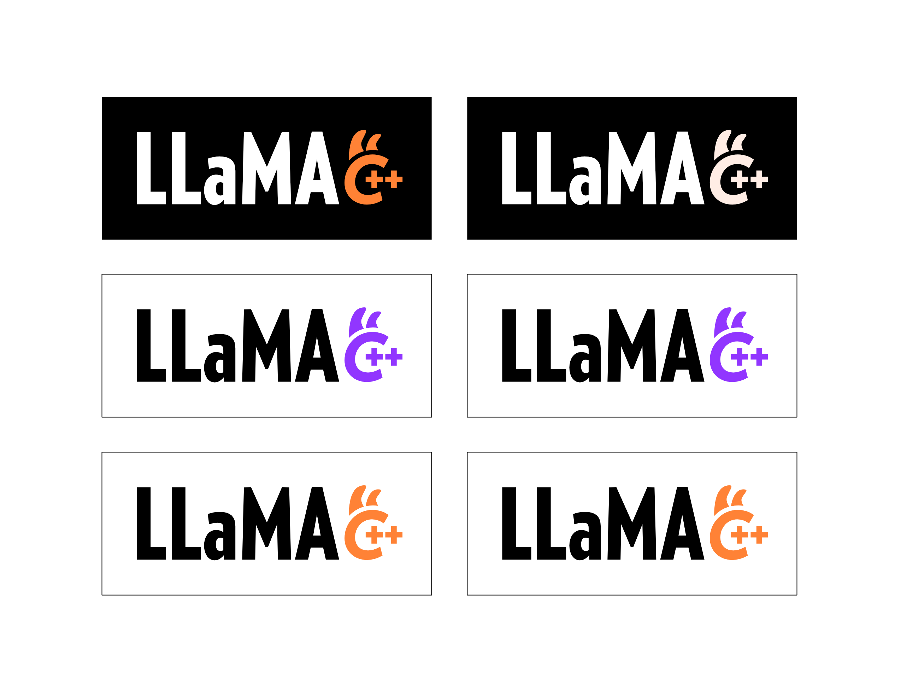
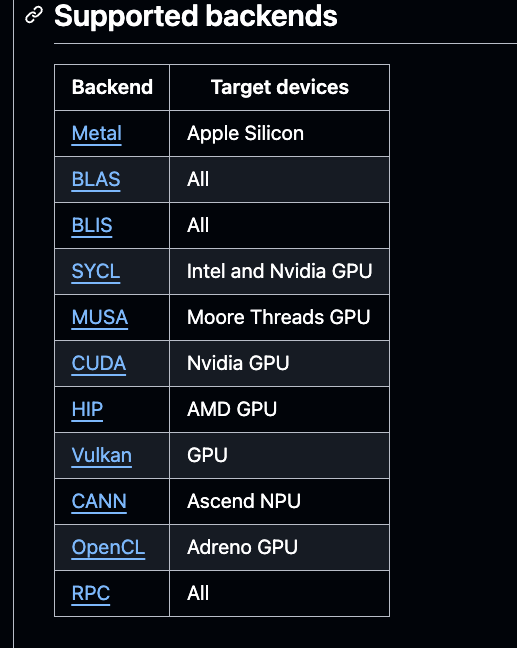
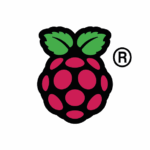
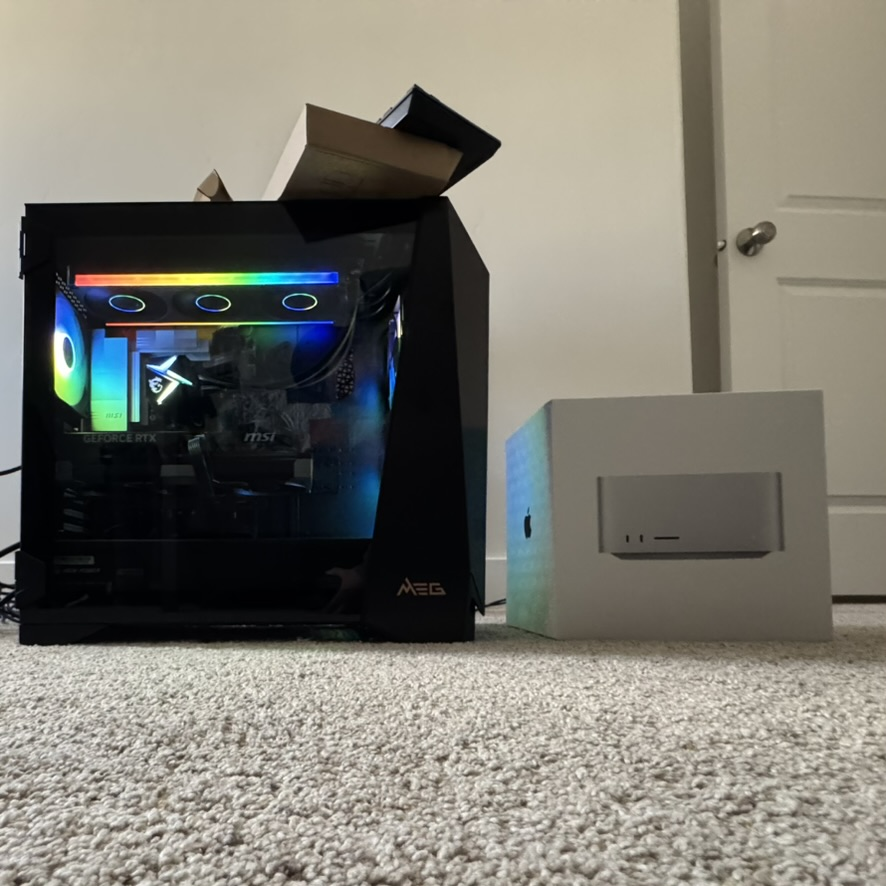

<!-- _class: lead -->

# Self-Hosting Models IS for Nerds: A Practical Guide to Local AI Dev 
### A developer's take on Ollama, Llama.cpp, and building smart with your own gear.
by: Miriah Peterson  

---

## Who Am I?

- Engineer, tinkerer, and homelab builder
- Data Engineer as SchoolAI 
- I built [IAM_pedro](github.com/soypetetech/IAM_pedro) — a locally hosted AI discord and twitch bot
- Have been streaming all my work with Pedro on [Twitch](https://twitch.tv/soypetetech) and it makes for some great content


---

### 👋 Quick poll for the room:

- Who is self-hosting models?
- Who is using APIs (OpenAI, Claude)?
- Who has used Ollama or Llama.cpp?

---

## Why Local?

- AI is **experimental** — it takes a lot of iteration to get right
- Local dev = faster feedback, higher throughput, and more calls
- **Ownership** of your workflow and data

<!-- faster throughput = more calls = more iterations = better results
s definitely a machine dependent situation, but anyone running an apple silicon mac can run a small model locally without any issues -->

---

## The Local AI Hosting

- [**Ollama**](https://ollama.com/) — LLM runner for open source models
- [**llama.cpp**](https://github.com/ggml-org/llama.cpp) — Lean inference engine for open source models
- [**LMStudio**](https://lmstudio.ai/) - UI based model runner for open source models
- [**vLLM**](https://github.com/vllm-project/vllm) - Prod ready LLM serving framework

<!-- Ollama has a repo of models you can run locally, including LLaMA3, Mistral, and Qwen. lmstudio works the same way, you only get models that are available in their repo. llama.cpp is a library that allows you to run models locally, but you have to download the model files yourself. it supports gguf files and I just find my models on Hugging Face and download them manually. at the end of the day they all wrap llama.cpp but some will be easier for certain users. Although I havent used VLLM, it's docs seem t ome more cloud native than others. but again, you are using what they provide-->
---

## What is Ollama?

- **Ollama** is a local-first LLM runner
- Run models with a single command
- It is written in Go and uses Llama.cpp under the hood


---
## Ollama

- Run models like LLaMA3, Mistral, Qwen locally
- Works on CPU or GPU
- Perfect for:
  - Prompt testing
  - Embedding generation
  - POC for AI projects

<!-- There is additional work to do to setup gpu integration, but it works with both nvidia and amd gpus. GPU config is a little tricky, so I dont think it is great for local dev, but nice for homelabing-->


---

## Demo: Ollama


```bash
ollama run llama3
```

> Fast, easy, portable. Great for solo developers.

<!-- _class: demo -->

---

## Connecting Ollama to Your Workflow
Code:
  - Ollama can be used in any programming language
  - Use Ollama's REST API or CLI
  - Lanchain also supports Ollama so you can just use it in your existing LLM workflows

---

## Drawbacks of Ollama

- **Limited to Ollama's model repo** — you can’t run any model you want.
- **Not as lightweight as llama.cpp** — Ollama is a wrapper around llama.cpp, so it has some overhead.
- **Not as flexible** — Ollama is designed for ease of use, not flexibility.

> There just aren't as many nobs to turn.
---

## What is Llama.cpp?
- **Llama.cpp** is a lean inference engine for open source models
- It allows you to run models locally with minimal dependencies
- Supports [GGUF files](https://huggingface.co/Qwen/Qwen3-Embedding-0.6B-GGUF) for any model. 

<!-- we should mention that I just download the gguf files from Hugging Face and run them locally. -->




---

<!-- _class: demo -->

## Demo: Llama.cpp 
```bash
llama-server --hf-repo TheBloke/Mistral-7B-Instruct-v0.2-GGUF \
--hf-file mistral-7b-instruct-v0.2.Q3_K_S.gguf
```

---

## Yes, It can use GPUs
- Supports NVIDIA and AMD GPUs



<!-- the note for gpus is that you will have to build llama.cpp from source with the appropriate flags for your gpu. -->

<!-- ---

## AI homelab stack

If you want an AI for your homelab, you need:
1 raspberry pi or old laptop with 8GB RAM

[raspberry pi setup video](https://youtu.be/_o07iZYSAfU?si=gDzRBPOEBO42DhmU)

 -->

---

<!-- _class: demo -->

## My Homelab:

- MSI tower with 64GB RAM and NVIDIA RTX 5090
- WSL 2 with Ubuntu
- llama.cpp for model inference
- Tailscale for secure local network access
- Golang bot integration for Discord and Twitch on kubernetes(soon)



---
## Vector Stores and Embeddings
- **Vector stores** are databases for storing embeddings
- Postgres is a great option for local vector stores
  - [pgvector](https://github.com/pgvector/pgvector) is a Postgres extension for vector search

<!-- make the note that I am using this with supabase -->
---

## Vector Stores and Embeddings

How to get embeddings:
```bash
curl https://api.openai.com/v1/embeddings \
  -H "Authorization: Bearer $OPENAI_API_KEY" \
  -H "Content-Type: application/json" \
  -d '{
    "input": "The food was delicious and the waiter...",
    "model": "text-embedding-ada-002",
    "encoding_format": "float"
  }
```

<!-- no matter what you run, openai api is the server standard. so I call this api for ollama in server mode and llama.cpp in server mode. -->

---

## Vector Stores and Embeddings

Tips: 
- Use **Ollama** or **Llama.cpp** to generate embeddings locally using the models you have running
- Use **pgvector** to store and query embeddings in Postgres and do vector search/comparisons
- You can manage vector stores with code, but I rarely send vectors directly to an llm. I use them for search and retrieval.

---

<!-- ## Local AI coding tools

* [**llama.vim**](https://github.com/ggml-org/llama.vim) - LLM-powered Vim plugin 
* [**llama.vscode**](https://github.com/ggml-org/llama.vscode) - LLM-powered VSCode extension

<!-- these do not run with server mode, they call the binaries directly. They are great for local-first coding with LLMs. -->

<!-- --- --> -->
## Future For PedroGPT

* Github Actions for CI/CD: 
  - use the action to trigger a call to local runners that run on my homelab and call the Ollama or llama.cpp API. will send code diffs to the bot for analysis. Write summaries, comments, and changes to the codebase in comments.
* Local-first AI agents:
  build a cli that like claude code uses prompts/regex to create agents that generate code, run tests, and deploy changes.

---
## Future For PedroGPT
* Vector store integration:
  - use pgvector to store code embeddings and do vector search for code snippets, similar to how you would use a code search engine like Sourcegraph or OpenAI's code search.
  - use vector store for twitch quick links so that the bot can quickly find and respond to user queries about past streams, code snippets, or commands.

---

## Final Thoughts

> “Don’t wait for GPU credits—your machine is already powerful.”

- I ran pedro on a $200 refurbished desktop with 32GB RAM for a year. It worked great and did about 11 tokens per second.

- Local-first AI = speed, control, creativity without waiting for cloud credits.
- Encourage reproducible, offline-first experimentation

---

## Downside of Local AI

  - Limited to your hardware
  - No cool tools for experimentation like Langfuse 
  - Requires more setup and maintenance

---

## Q&A + Discussion

🤔 What’s your local setup?  
📦 Who’s experimenting with vector stores, streaming, or edge agents?  
⚙️ What tools do you want to see built?

---

# Thank You

Follow me at [@soypetetech](https://substack.com/@soypetetech)  
Questions, feedback, or collabs? Let’s connect.

