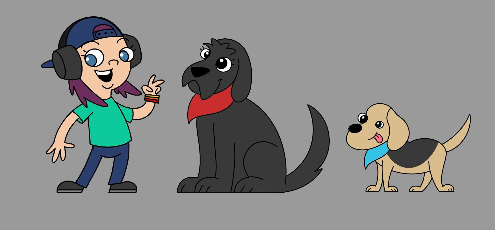

# Supabase is My Favorite Postgres
Miriah Peterson

---
# What do I do with Postgres?

* Twitter bot storage on CockroachDB
* Webservices course on Docker Postgres and Go
* Analytics on Postgres + DuckDB with Docker
* Twitch Chat storage on Supabase

---

# Let's talk about my Supabase project

Pedro is my twitch chat bot. It uses langchain-go to store chat messages in Supabase.

---

# Why Supabase?

Because Another streamer told me about it. 
[TheAltF4](https://www.twitch.tv/thealtf4stream)

---

# What am I doing with Supabase?

* Storing twitch chat messages
* Vectorstore for chat messages and command lookup
* Store llm responses

--- 

# Demo

I just use the web UI :)

--- 

# Contact

* [Twitter @captainnobody1](https://www.twitter.com/captainnobody1)
* [GitHub soypete](https://www.github.com/soypete)
* [LinkedIn](https://www.linkedin.com/in/miriah-peterson-35649b5b)
* [twitch](https://twitch.tv/soypetetech)

